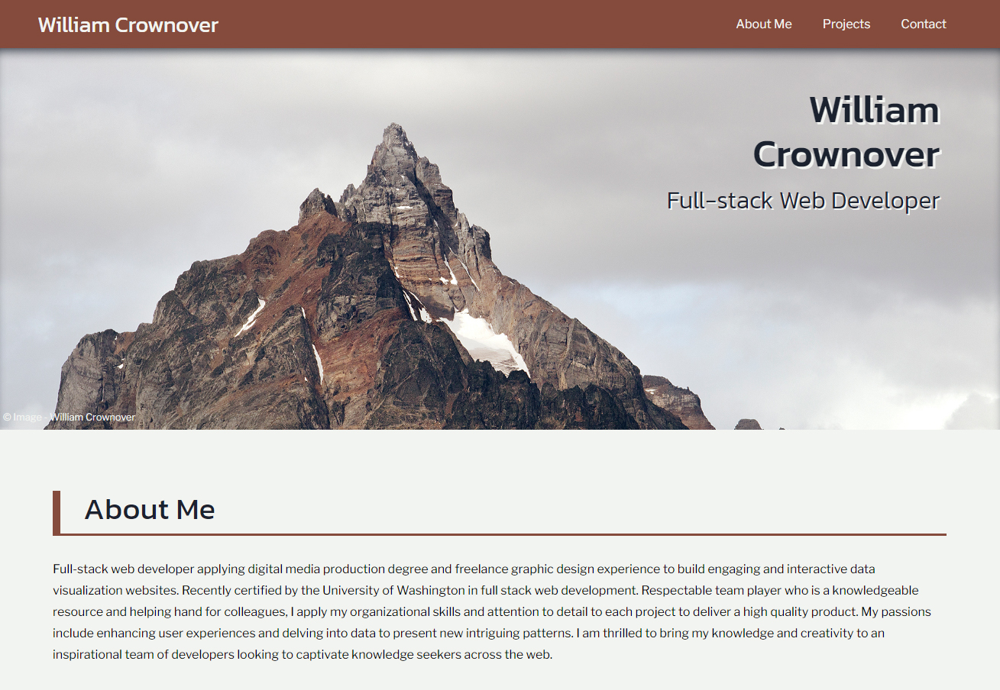

# William Crownover’s Github Portfolio

## Description

The most recent version of my web development portfolio featuring projects Shelf-Life Continued, US Voter Representatives, and Weather Forecast Dashboard. The portfolio is mobile responsive and features two of my own photographs from Antartica. Feel free to check it out!

## Live Site

https://williamcrownover.github.io/

## Technologies & Design

- The photography on the page was sourced from my own work, specifically from a trip to Antarctica
- Flexbox and Media Queries are implemented to create a responsive layout that can adjust to a mobile display

## Future Development
I will be updating my portfolio on a regular basis to include my feature projects.

## License
Licensed under the MIT License - https://opensource.org/licenses/MIT

## Contact
If you have any questions you can email me at williamcrownover1@gmail.com.

You can also check out my other work on GitHub at [WilliamCrownover](https://github.com/WilliamCrownover)