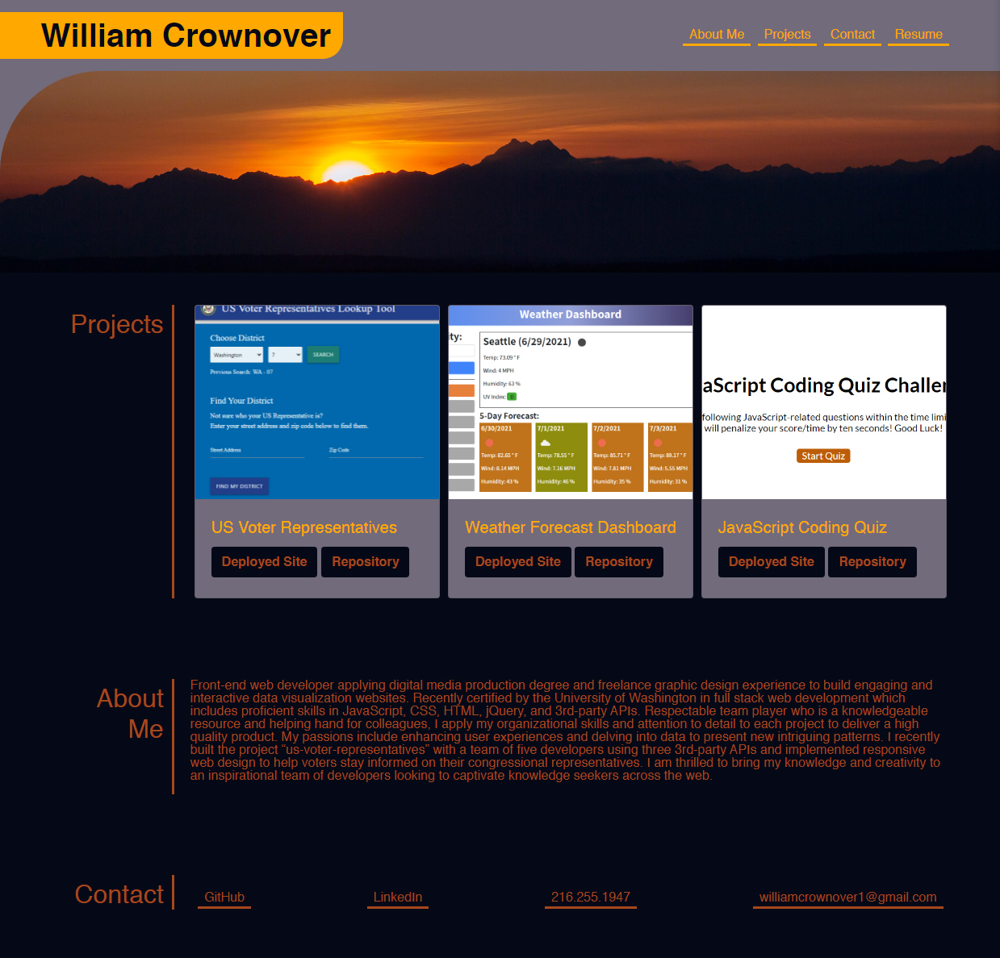

# William Crownover’s Github Portfolio

## Description

This project will be the host for my portfolio of web development work available to the public. I built this website so that I can easily consolidate my work for those who may be interested in using it or considering hiring me. My portfolio should demonstrate my abilities and growth of my skills in fullstack web development.

The form of this project consists of a home page that leads to sub pages containing specific projects. Included on the home page is a nav bar leading to about me, projects, contact, and resume. The project section includes interesting photos of the projects that will intrigue viewers to click into the deployed site or explore the GitHub repo of that website.

## Live Site

https://williamcrownover.github.io/

## Technologies & Design

- The hero image used for the site was sourced from my own photography
- Flexbox and Media Queries are implemented to create a responsive layout that can adjust to a mobile display
- Bootstrap and jQuery were linked into the project

## Future Development
I will be updating my portfolio on a regular basis to include my feature projects.

## License
Licensed under the MIT License - https://opensource.org/licenses/MIT

## Contact

If you have any questions you can email me at williamcrownover1@gmail.com.

You can also check out my other work on GitHub at [WilliamCrownover](https://github.com/WilliamCrownover)